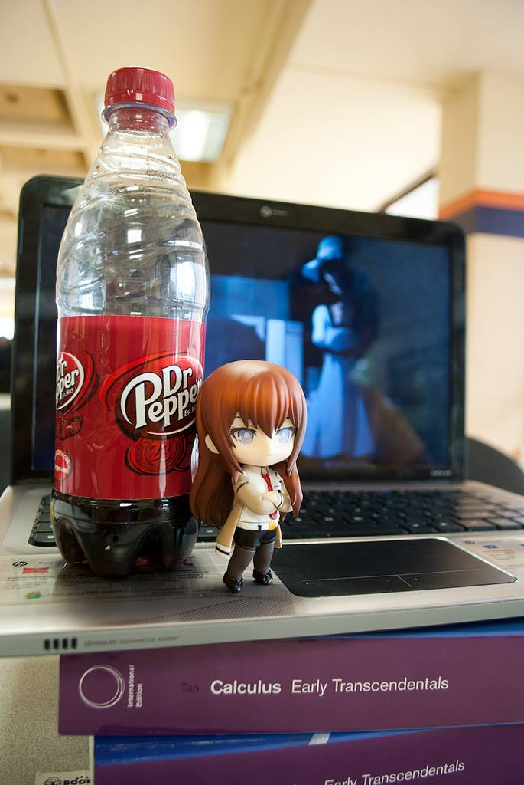
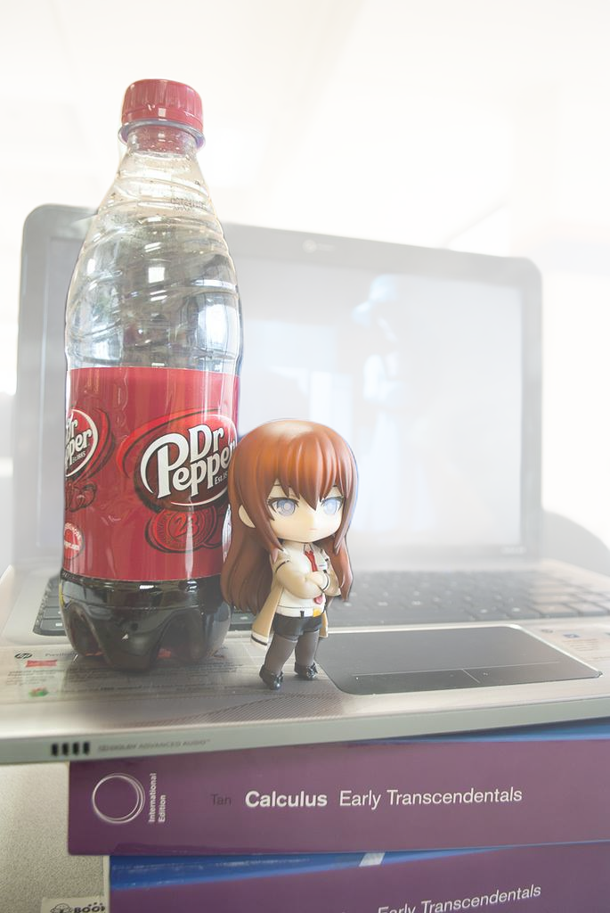

# winterveil
Add winter effect to images

## Features
- Add fog
- WIP Add showfall
- WIP Add fallen snow

## Example
| Input                        | Output                       |
| ---------------------------- | ---------------------------- |
|  |  |

## Usage
### Install dependencies
```
python3 -m venv .venv
source .venv/bin/activate
pip install -r requirements.txt
```

### Winterize image
```
python3 main.py path_to_image
```

## Acknowledgments

This project uses the [MiDaS depth estimation model]([link-to-model-repository-or-paper](https://arxiv.org/abs/1907.01341)) by René Ranftl, Katrin Lasinger, David Hafner, Konrad Schindler, and Vladlen Koltun, which is licensed under the MIT License. If you use this project, please also cite their original work:

```bibtex
@article{Ranftl2020,
	author    = {Ren\'{e} Ranftl and Katrin Lasinger and David Hafner and Konrad Schindler and Vladlen Koltun},
	title     = {Towards Robust Monocular Depth Estimation: Mixing Datasets for Zero-shot Cross-dataset Transfer},
	journal   = {IEEE Transactions on Pattern Analysis and Machine Intelligence (TPAMI)},
	year      = {2020},
}
```

```bibtex
@article{Ranftl2021,
	author    = {Ren\'{e} Ranftl and Alexey Bochkovskiy and Vladlen Koltun},
	title     = {Vision Transformers for Dense Prediction},
	journal   = {ArXiv preprint},
	year      = {2021},
}
```
